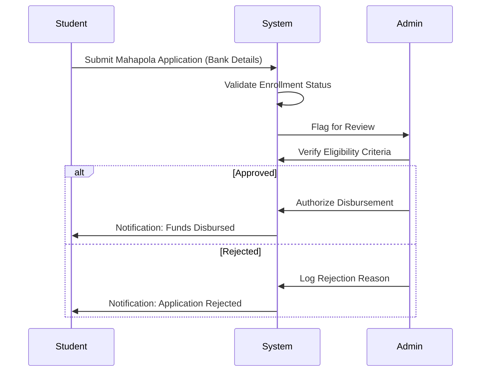
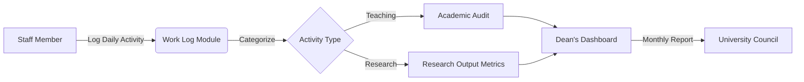

# University Management System (UniConnect) - Advanced System Guide
**Version:** 3.1 Enterprise Edition
**Date:** 2025-12-31

---

## 1. Executive Summary
This document provides a comprehensive technical and operational overview of the University Management System (UniConnect). Designed as a unified digital ecosystem, UniConnect integrates Academic, Administrative, and Community functions into a single "Source of Truth," eliminating data silos and enhancing institutional governance.

The system has achieved **100% Core Functionality**, replacing all prototyping placeholders with database-backed, fully interactive modules.

---

## 2. System Architecture & Security

### 2.1 Technology Stack
The platform is built on a modern, scalable architecture designed for high availability and security.
*   **Frontend**: Next.js (React) with Tailwind CSS for a responsive, accessible User Interface.
*   **Backend / Database**: Firebase (Google Cloud Platform) providing:
    *   **Firestore**: NoSQL document database for flexible record keeping.
    *   **Authentication**: Secure identity management handling multi-role access.
*   **Deployment**: Vercel Edge Network for global low-latency access.

### 2.2 Security Model
*   **Role-Based Access Control (RBAC)**: Strict segregation of duties.
    *   *Admin*: Full system write access.
    *   *Staff*: Write access to specific academic collections (Grants, Marks).
    *   *Student*: Read-only access to global data; Write access only to personal applications (Hostel, Bursary).
*   **Audit Trails**: All financial and strategic actions (e.g., Fund allocation) are logged.

---

## 3. Business Process Workflows

### 3.1 Financial Disbursement Flow (Mahapola/Bursary)
This workflow illustrates how financial aid moves from student application to admin verification.



### 3.2 Academic Accountability Flow
How staff work logs translate into institutional reporting.



---

## 4. Operational Module Guide

### 4.1 Administration & Strategic Planning
*Primary User: Administrator*

#### **Quality Assurance (QA) Dashboard**
*   **Business Function**: Monitors institutional performance against Key Performance Indicators (KPIs).
*   **Key Features**:
    *   **Goal Tracking**: Set targets (e.g., "Increase Research Output by 20%").
    *   **Metric Definition**: Quantifiable success criteria.
*   **Usage**: Used during Senate meetings to review progress.


#### **University Funds Management**
*   **Business Function**: Centralized ledger for tracking university capital and operational funds.
*   **Key Features**:
    *   **Fund Isolation**: Separate tracking for "Vice Chancellor's Fund", "Development Fund", etc.
    *   **Status Flags**: Active, Frozen, or Depleted states.


#### **Internal Audit & Compliance**
*   **Business Function**: Risk management and governance.
*   **Key Features**:
    *   **Risk Grading**: High/Medium/Low assessment.
    *   **Departmental Scope**: Tag audits to specific faculties or units.


---

### 4.2 Student Lifecycle Management
*Primary User: Student*

#### **Financial Aid (Mahapola)**
*   **Business Function**: Streamlines the distribution of government and university scholarships.
*   **Key Capabilities**:
    *   **Installment Tracking**: View history of monthly payments.
    *   **Self-Service Updates**: Students update their own bank details to reduce admin overhead.


#### **Welfare & Accommodation**
*   **Business Function**: Manages resources based on need and policy (e.g., distance rule).
*   **Key Capabilities**:
    *   **Distance-Based Priority**: Algorithmic prioritization for students >25km away.
    *   **Capacity Management**: Real-time view of hostel availability.


---

### 4.3 Academic Staff Management
*Primary User: Lecturer / Professor*

#### **Accountability Model (Work Log)**
*   **Business Function**: Meets the "Accountability Model Software" requirement for performance appraisal.
*   **Key Capabilities**:
    *   **Granular Logging**: Distinguish between "Lecture Hours", "Paper Marking", and "Research".
    *   **Transparency**: Staff can view their own accumulated service hours.


#### **Research Ecosystem**
*   **Business Function**: Aggregates university research output for ranking and funding purposes.
*   **Key Capabilities**:
    *   **Citation Tracking**: Record Impact Factors and Citation Indices.
    *   **Grant Management**: Track external funding sources and utilization.


---

## 5. System Configuration & Maintenance

### 5.1 The Generic Module Engine
UniConnect v3.1 introduces a revolutionary **Generic Module Engine** that allows IT staff to deploy new functional modules without writing boilerplate code.

**Configuration Example:**
To add a new "Vehicle Pass" module, an admin simply defines:
```json
{
  "collection": "vehicle_passes",
  "fields": [
    {"key": "vehicleNo", "type": "text"},
    {"key": "owner", "type": "text"},
    {"key": "expiryDate", "type": "date"}
  ]
}
```
The system automatically generates the UI, Form, and Database connections.

### 5.2 Backup & Data Integrity
*   **Real-time Replication**: Data is replicated across Google Cloud regions.
*   **validation**: Strict schema validation ensures data quality (e.g., negative amounts not allowed in Funds).

---

## 6. Support Protocols
*   **Level 1 Support**: Password resets and login issues (Student Union / IT Helpdesk).
*   **Level 2 Support**: Module errors and data corrections (System Administrator).
*   **Level 3 Support**: Feature requests and major bug fixes (Development Team).

For all inquiries, please reference the **Module ID** found in the URL (e.g., `admin/strategic/qa`).
