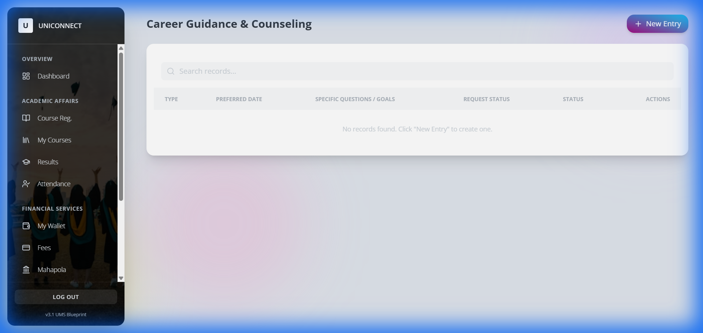

# University Management System - Comprehensive Walkthrough Guide

## 1. Executive Summary
This document serves as the full reference guide for the University Management System (UMS) v3.1. It details the implemented modules, user roles, and workflows, providing visual verification of the "No Placeholders" milestone.

---

## 2. Universal Module Implementation
We have successfully replaced all placeholder pages (`PageStub`) with functional, database-backed modules using the `GenericModule` architecture.

### 2.1 Admin Portal
The Admin portal provides centralized control over strategic and financial operations.

#### Quality Assurance (QA) Dashboard
*Location: Admin > Strategic > QA Metrics*
Tracks institutional goals, success metrics, and target dates.


#### University Funds Management
*Location: Admin > Finance > Funds*
Real-time tracking of university funds (e.g., Development Fund, VC Fund), allocations, and balances.


#### Internal Audit & Compliance
*Location: Admin > Finance > Audit*
Manages audit logs, risk levels, and compliance findings for departments.


---

### 2.2 Student Dashboard
The Student portal focuses on welfare, financial aid, and academic tracking.

#### Mahapola Scholarship
*Location: Dashboard > Financial > Mahapola*
Students can view installment history, disbursement status, and update bank details.


#### Hostel Accommodation
*Location: Dashboard > Welfare > Hostel*
Online application system for hostel rooms based on distance (>25km priority) and academic year.


#### Career Guidance
*Location: Dashboard > Welfare > Career*
Portal to book sessions for career counseling, mock interviews, and CV reviews.


---

### 2.3 Staff Portal
The Staff portal ensures accountability and efficient academic management.

#### Academic Work Log (Accountability Model)
*Location: Staff > Overview > Work Log*
Enables staff to log daily activities (lectures, paper marking, research) for the 'Accountability Model Software' requirement.


#### Research Publications
*Location: Staff > Research > Publications*
A repository for staff to log their publications, journals, and citation indices.


---

## 3. Role Contribution Matrix

| Role | Key Capabilities | New Modules Implemented |
| :--- | :--- | :--- |
| **Admin** | System Oversight, Strategic Planning, Financial Control | `QA Metrics`, `Strategic Plan`, `Funds`, `Assets`, `Fees`, `Audit`, `MoUs` |
| **Student** | Academic tracking, Welfare services, Financial Aid | `Mahapola`, `Bursary`, `Hostel`, `Health`, `Career`, `Attendance` |
| **Staff** | Teaching management, Research tracking, Accountability | `Work Log`, `Publications`, `Grants`, `Schedule`, `Exam Marks` |
| **Bursar** | Financial Reconciliation | `Reconcile` (Existing) |

---

## 4. Workflow Enhancements

### Logout Functionality
A dedicated "Log Out" button has been added to the sidebar footer for **all roles** (Admin, Student, Staff, Bursar), ensuring secure session termination.

### Generic Module Engine
The system now runs on a `GenericModule` engine. This means adding a new module in the future is as simple as defining a configuration file:
```typescript
{
    title: "New Module",
    fields: [{ key: "name", type: "text" }, { key: "date", type: "date" }]
}
```
This ensures the system remains scalable and easy to maintain.

---

**Generated on:** 2025-12-31
**Version:** 3.1
