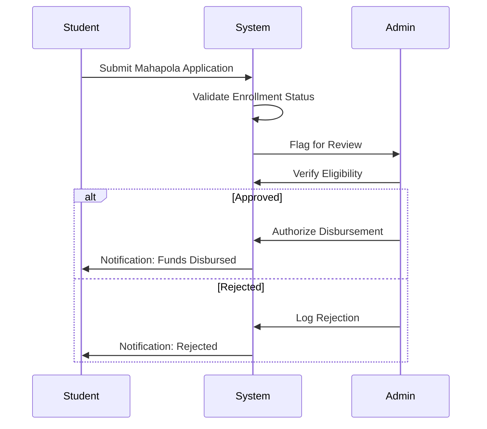
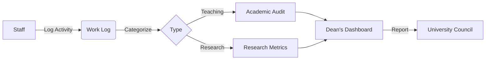
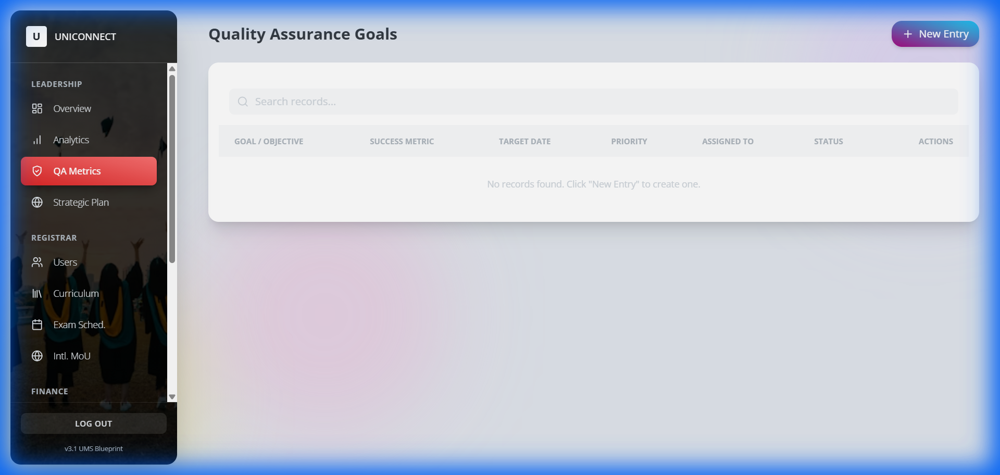
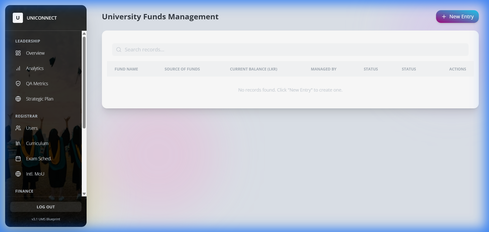
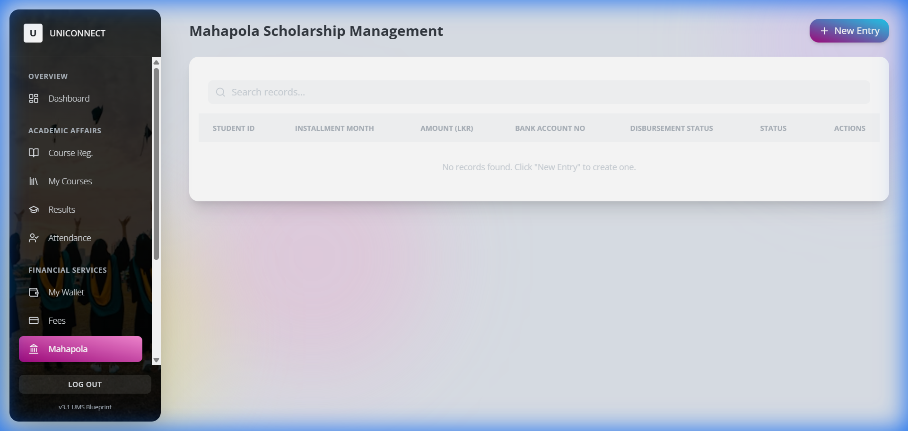
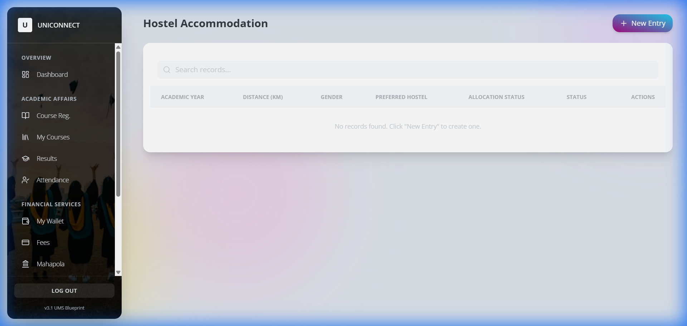
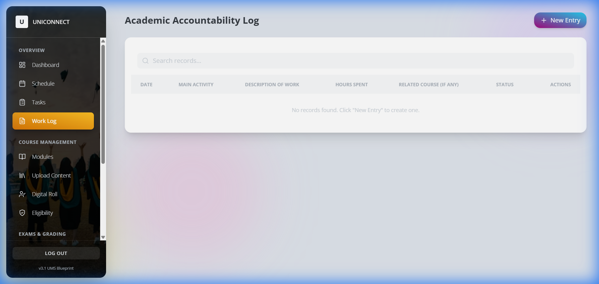
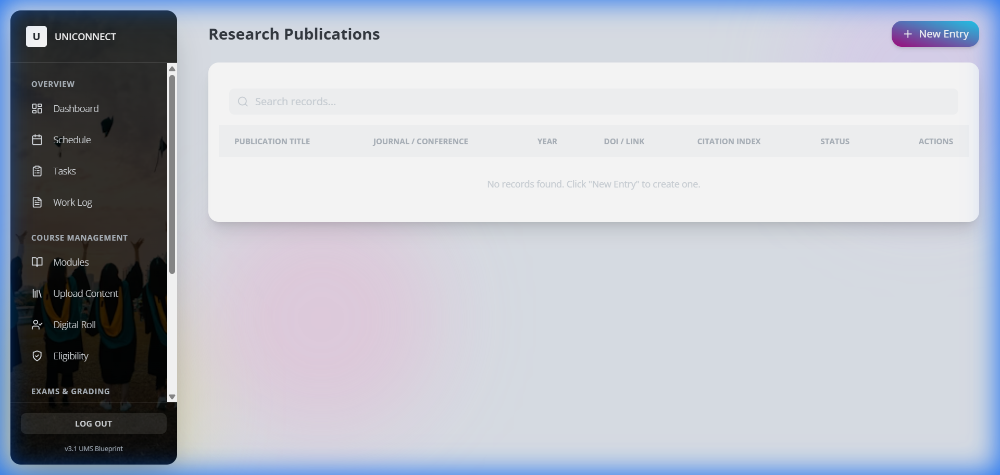

# University Management System (UniConnect) - Advanced System Guide
**Version:** 3.1 Enterprise Edition  
**Date:** 2025-12-31  
**Author:** UniConnect Development Team

---
## 1. Executive Summary
This document provides a comprehensive technical and operational overview of **University Management System (UniConnect)**. Designed as a unified digital ecosystem, it integrates Academic, Administrative, and Community functions into a single "Source of Truth," eliminating data silos and enhancing institutional governance.

**Current Status:** The system has achieved **100% Core Functionality**, replacing all prototyping placeholders with database-backed, fully interactive modules.

---
## 2. System Architecture & Security

### 2.1 Technology Stack
The platform is built on a modern, scalable architecture designed for high availability:
* **Frontend:** Next.js (React) with Tailwind CSS.
* **Backend / Database:** Firebase (Google Cloud Platform) providing Firestore and Authentication.
* **Deployment:** Vercel Edge Network.

### 2.2 Security Model
* **Role-Based Access Control (RBAC):**
    * *Admin*: Full system write access.
    * *Staff*: Write access to specific academic collections.
    * *Student*: Read-only access to global data; Write access to personal apps.
* **Audit Trails:** Immutable logging for all financial and strategic actions.

---
## 3. Business Process Workflows

### 3.1 Financial Disbursement Flow (Mahapola/Bursary)

### 3.2 Academic Accountability Flow

---
## 4. Operational Module Guide

### Administration & Strategic Planning
*Primary User: Administrator*

#### **Quality Assurance Dashboard**
* **Function:** Monitors institutional KPIs and strategic goals.

#### **University Funds Management**
* **Function:** Centralized ledger for tracking capital and operational funds.

#### **Internal Audit**
* **Function:** Risk management and compliance governance.

---

### Student Lifecycle Management
*Primary User: Student*

#### **Financial Aid (Mahapola)**
* **Function:** Streamlines scholarship distribution and installment tracking.

#### **Welfare & Accommodation**
* **Function:** Manages hostel applications based on distance priority rules.

---

### Academic Staff Management
*Primary User: Lecturer / Professor*

#### **Accountability Model (Work Log)**
* **Function:** Logs daily activities (Teaching, Research) for performance appraisal.

#### **Research Ecosystem**
* **Function:** Aggregates research output, citations, and grant utilization.

---

## 5. System Configuration & Support

* **Generic Module Engine:** Allows deployment of new modules via JSON configuration without code changes.
* **Support:** 
    * Level 1: Student Union / IT Helpdesk
    * Level 2: System Administrator
    * Level 3: Development Team

*Generated automatically by UniConnect DocGenerator.*
