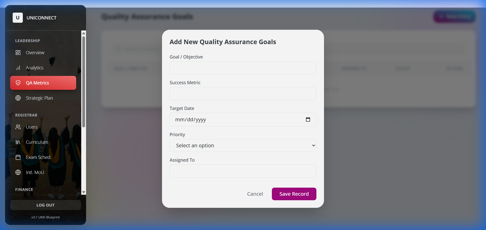
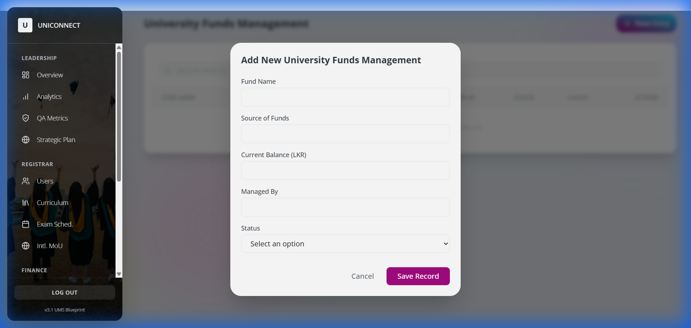

# UniConnect User Manual (v3.1)

## Introduction
Welcome to the UniConnect University Management System. This manual provides a step-by-step guide to using the core modules of the system. We have achieved a "Zero Placeholder" state, meaning every module described here is fully functional and ready for data entry.

---

## 1. Getting Started

### Login
Access the system at `https://uniconnect-drab.vercel.app/`.
*   **Admin**: `admin@unipay.lk` / `123456`
*   **Student**: `student@unipay.lk` / `123456`
*   **Staff**: `staff@unipay.lk` / `123456`

### Navigation & Logout
The sidebar provides access to all modules relevant to your role. To exit securely, scroll to the bottom of the sidebar and click the **Log Out** button.

---

## 2. Admin Portal Guide

### 2.1 Quality Assurance (QA) Goals
**Objective**: Define and track institutional strategic goals.

**Step 1: View QA Dashboard**
Navigate to **Leadership > QA Metrics**. You will see a list of current goals and their status.

**Step 2: Add New QA Goal**
Click the **New Entry** button in the top right. A form will appear.
*   **Goal**: Enter the strategic objective (e.g., "Achieve ISO 9001").
*   **Metric**: How success is measured.
*   **Priority**: High/Medium/Low.

### 2.2 University Funds
**Objective**: Manage financial allocations for university funds.

**Step 1: View Funds**
Navigate to **Finance > Funds**.

**Step 2: Add New Fund**
Click **New Entry**.
*   **Fund Name**: e.g., "Vice Chancellor's Fund".
*   **Allocation**: Current balance in LKR.

---

## 3. Student Portal Guide

### 3.1 Mahapola Scholarship
**Objective**: Check scholarship status and history.

**Step 1: View Status**
Navigate to **Financial > Mahapola**.

**Step 2: Request / Update**
Click **New Entry** (or "Update Details") to submit bank info for a new installment.

### 3.2 Hostel Accommodation
**Objective**: Apply for on-campus housing.
Navigate to **Welfare > Hostel**.

---

## 4. Staff Portal Guide

### 4.1 Academic Work Log
**Objective**: Log daily activities for the 'Accountability Model'.

**Step 1: View Log History**
Navigate to **Overview > Work Log**.

**Step 2: Log a New Activity**
Click **New Entry**.
*   **Activity**: Select Lecture, Research, or Marking.
*   **Hours**: Duration of work.
*   **Description**: Brief details.

### 4.2 Research Publications
**Objective**: Record academic papers and citations.
Navigate to **Research > Publications**.

---

## 5. Support
For technical issues, contact the IT Centre.
*   **System Version**: 3.1 (Blueprinted)
*   **Support Email**: helpdesk@vau.ac.lk
