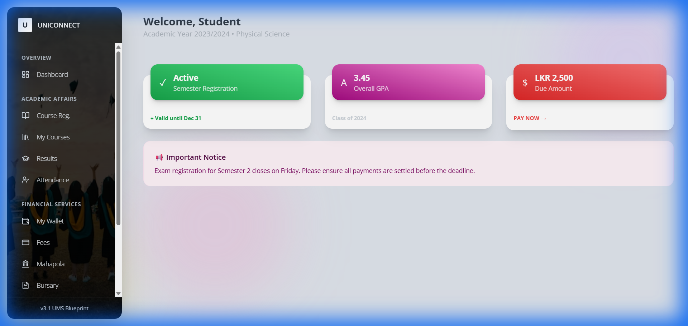
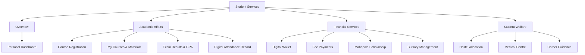
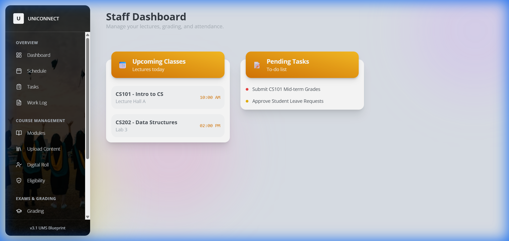
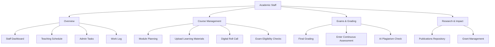
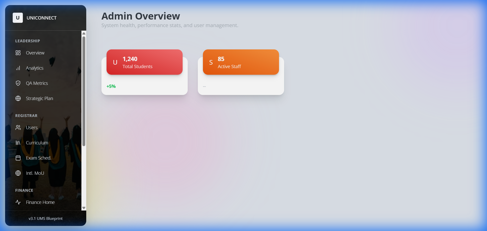
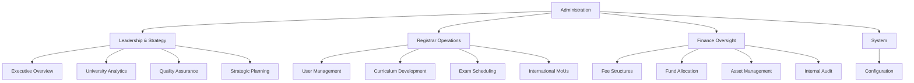
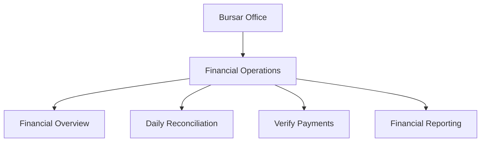
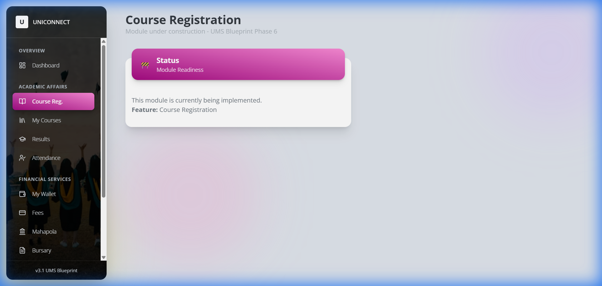
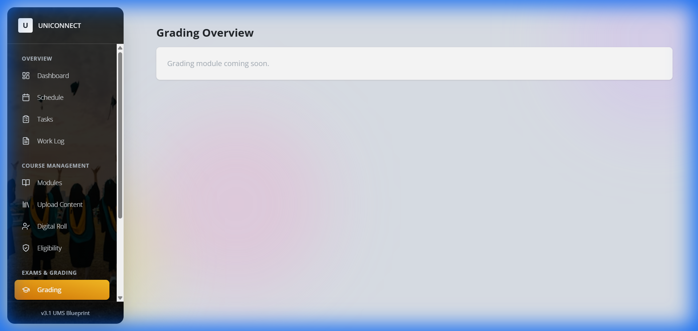
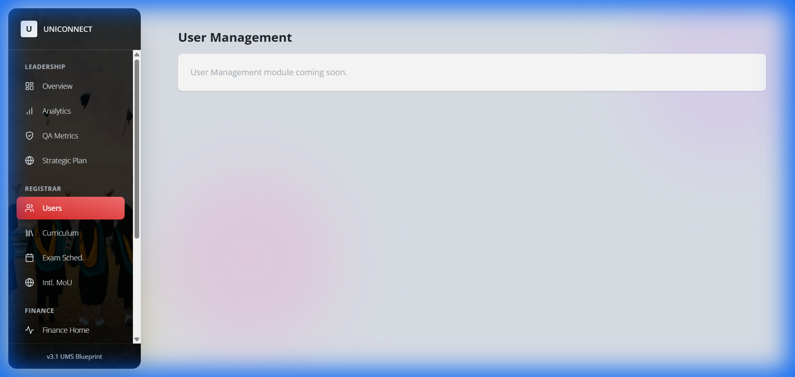

# University Management System (UniConnect) - System Overview

## Introduction
**UniConnect** is a modern, unified digital platform designed to streamline the complex administrative, academic, and financial operations of the university. It provides a tailored, intuitive experience for every member of the university ecosystem—Students, Academic Staff, Administrators, and Financial Officers.

The system is built on a **secure, real-time cloud infrastructure**, ensuring that data is always up-to-date, accessible from anywhere, and protected with enterprise-grade security.

---

## Key Capabilities at a Glance

*   **For Students**: A single hub for all academic and campus life needs. View results, pay fees, register for courses, and access welfare services without standing in queues.
*   **For Staff**: Digital tools to manage teaching, grading, and research. Automated attendance tracking and streamlined mark entry reduce administrative burden.
*   **For Administration**: Strategic oversight with real-time analytics. manage curriculum, users, and compliance from a central command center.
*   **For Finance (Bursar)**: Real-time financial reconciliation, automated fee tracking, and transparent auditing tools.

---

## System Structure (User-Wise)

The following diagrams illustrate the robust feature set available to each user role.

### 1. Student Portal
*Focus: Personal Academic Journey & Campus Services*

### 2. Academic Staff Portal
*Focus: Teaching, Evaluation & Research*

### 3. Administration Portal (Registrar & VC)
*Focus: Governance, Strategy & Operations*

### 4. Bursar (Finance) Portal
*Focus: Financial Integrity & Reconciliation*

---

## Role-Based Menu Explorer & Walkthroughs

This section describes exactly what a user sees and does in each menu option.

### 1. Student Portal Navigation
*Primary Goal: Academic Success & Financial Clarity*

| Menu Section | Item | Action / Walkthrough |
| :--- | :--- | :--- |
| **Overview** | **Dashboard** | **View**: Check GPA, Semester Status, and Wallet Balance. **Action**: Click widgets to jump to Results or Payments. |
| **Academic** | **Course Reg.** | **Step 1**: Browse open courses for the semester. **Step 2**: Click "Enroll" on desired modules. **Step 3**: System checks prerequisites > Confirms enrollment. |
| | **My Courses** | **View**: List of active enrolled modules. **Action**: Click a module to access learning materials, assignments, and announcements. |
| | **Results** | **View**: Full academic transcript and GPA calculation. **Action**: Download official semester reports (PDF). |
| | **Attendance** | **View**: Check attendance percentage per module. **Alert**: Flags if attendance drops below 80%. |
| **Financial** | **My Wallet** | **View**: Total balance, scholarship inflows, and payment outflows. **Action**: Top up wallet via payment gateway. |
| | **Fees** | **View**: Outstanding tuition or exam fees. **Action**: Click "Pay Now" > Select Payment Method > Generates Receipt. |
| | **Mahapola** | **View**: Scholarship installment status and history. **Action**: Acknowledge receipt of funds. |
| | **Bursary** | **Action**: Apply for financial aid > Upload Income Proof > Submit for Bursar review. |
| **Welfare** | **Hostel** | **Action**: Apply for accommodation > Select Room Type > View Allocation Status. |
| | **Health** | **Action**: Book medical appointments > View digital medical history. |
| | **Career** | **Action**: View job board > Book counseling sessions. |

### 2. Academic Staff Navigation
*Primary Goal: Efficient Teaching & Evaluation*

| Menu Section | Item | Action / Walkthrough |
| :--- | :--- | :--- |
| **Overview** | **Dashboard** | **View**: Upcoming Classes timeline and "To-Do" list (e.g., "Grade CS101"). |
| | **Schedule** | **View**: Weekly teaching timetable with room numbers. |
| | **Tasks** | **Action**: View administrative tasks assigned by Dean/HoD > Mark as "Done". |
| | **Work Log** | **Action**: Auto-generated log of teaching hours for payroll claims. |
| **Courses** | **Modules** | **View**: List of modules taught this semester. **Action**: Select to manage specific course details. |
| | **Upload Content** | **Step 1**: Select Module. **Step 2**: Drag & Drop Lecture Slides/Notes. **Step 3**: Publish to Student Portal. |
| | **Digital Roll** | **Step 1**: Select Active Class. **Step 2**: Display QR Code or Manually check students присутing. |
| | **Eligibility** | **View**: Auto-generated list of students eligible for exams based on attendance. |
| **Exams** | **Grading** | **Action**: Input final letter grades for verified students > Submit to Exam Board. |
| | **Enter Marks** | **Action**: Enter continuous assessment (assignment/mid-term) raw marks. |
| | **Plagiarism** | **Tool**: Upload student assignment > AI scans against repository > Returns Similarity Report. |
| **Research** | **Publications** | **Action**: Log new research papers > Updates academic profile. |
| | **Grants** | **Action**: Track grant utilization and detailed expenditure. |

### 3. Administration Navigation (Registrar/VC)
*Primary Goal: High-Level Oversight & Configuration*

| Menu Section | Item | Action / Walkthrough |
| :--- | :--- | :--- |
| **Leadership** | **Overview** | **View**: Campus pulse (Active Users, Financial Health, Critical Alerts). |
| | **Analytics** | **Tool**: Interactive charts showing multi-year trends (Enrollment, Pass Rates). |
| | **QA Metrics** | **View**: Compliance with UGC/Quality Assurance standards. |
| | **Strategic Plan** | **Action**: Define and track long-term university KPIs. |
| **Registrar** | **Users** | **Action**: Create/Edit User Accounts > Reset Passwords > Assign Roles. |
| | **Curriculum** | **Action**: Define new Degrees/Courses > Set Credits & Prerequisites. |
| | **Exam Sched.** | **Action**: Create exam timetables > Allocate exam halls & invigilators. |
| | **Intl. MoU** | **Action**: Manage partnerships with foreign universities. |
| **Finance** | **Fee Tracking** | **View**: Real-time monitor of fee collection rates across faculties. |
| | **Funds** | **Action**: Allocate budget to departments. |
| | **Assets** | **Action**: Inventory management (Buildings, Labs, Equipment). |
| | **Audit** | **Report**: Generate system-wide activity logs for internal audit. |
| **System** | **Config** | **Action**: Set global variables (Academic Year, Semester Dates). |

### 4. Bursar Navigation
*Primary Goal: Financial Integrity*

| Menu Section | Item | Action / Walkthrough |
| :--- | :--- | :--- |
| **Finance** | **Finance Home** | **View**: Cash flow summary, Daily Collection, Pending Approvals. |
| | **Reconcile** | **Workflow**:  1. System flags mismatched payments. 2. Bursar reviews bank feed vs system records. 3. Click "Reconcile" to force match or "Flag" to investigate. |

---

## Role Responsibility Matrix

This matrix clearly defines who is responsible for each core operation within the system.

| Operational Area | Action | **Student** | **Staff** | **Admin (Reg)** | **Bursar** |
| :--- | :--- | :---: | :---: | :---: | :---: |
| **Onboarding** | Account Creation | Applies | Verifies Docs | Final Approval | - |
| **Coursework** | Enrollment | **Initiates** | Advises | Configures | - |
| | Upload Content | Consumes | **Uploads** | - | - |
| | Attendance | Checks | **Marks** | Monitors | - |
| **Examinations** | Scheduling | View | - | **Creates** | - |
| | Grading | View | **Enters** | Publishes | - |
| **Finance** | Fee Payment | **Pays** | - | Sets Fees | **Verifies** |
| | Scholarship | Receives | - | - | Disburses |
| | Reconciliation | - | - | Audit | **Executes** |
| **Welfare** | Notifications | View | Send | Broadcast | - |
---

## Service Blueprint - Visual Evidence
*Real-time snapshots of role-based workflows.*

### 1. Student: Course Registration & Financials
*Action: Browsing active modules and checking wallet balance.*

*(Above: Student selects modules for the upcoming semester)*

### 2. Staff: Academic Administration
*Action: Managing modules and entering grades.*

*(Above: Interface for entering and finalizing student marks)*

### 3. Admin: System Governance
*Action: Managing user access and scheduling exams.*

*(Above: Registrar's view for verifying and managing student/staff accounts)*

### 4. Bursar: Financial Reconciliation
*Action: Verifying payments and auditing streams.*

*(Above: Active workspace for matching bank feeds with system receipts)*

---

## Interconnected Operational Workflows

### Workflow 1: The "New Student" Lifecycle (Onboarding)
**Goal**: Move a user from an "Applicant" to an "Active Student".

1.  **Student (External)**: Visits Portal > "Apply Now" > Fills Profile > Uploads NIC/A-Level Results.
2.  **System**: Creates "Provisional" account. Locked from Course Reg.
3.  **Admin (Registrar)**: Receives "New Intake" Alert > Reviews Documents > Clicks "Approve".
4.  **System**: Unlocks Student Account > Generates Student ID > Sends Welcome Email.
5.  **Student**: Logs in > Sees "Complete Registration Payment" task.
6.  **Student**: Pays Registration Fee via Gateway.
7.  **Bursar**: Payment auto-verified (or manual checks).
8.  **System**: Status updated to "Active" > "Course Reg" menu unlocks.

### Workflow 2: The "External Course" Application (Marketplace)
**Goal**: Allow a student to take an extra qualification (e.g., CIMA/MBA).

1.  **Student**: Navigation > **My Courses** > "Browse External Courses".
2.  **System**: Filters courses by Student's eligibility (e.g., Year 3 only).
3.  **Student**: Selects "MBA Foundation" > Clicks "Apply".
4.  **Admin**: "Curriculum" > Sees Application > Checks capacity > Approves.
5.  **Student**: Received "Offer Letter" notification > "Fees" menu updates.
6.  **Student**: Pays Module Fee (Installment 1).
7.  **System**: Auto-enrolls student in "MBA Foundation" module appearing in **My Courses**.

---

## Request for Stakeholder Input

To ensure UniConnect fits your specific university culture, we need your input on:
1.  **Approval Hierarchies**: Who specifically signs off on new student intakes? (Dean vs Registrar?)
2.  **Fee Structures**: Are there specific installment plans for External Courses?
3.  **Legacy Data**: Do we need to migrate existing records?
4.  **Custom Workflows**: Are there unique departmental processes we should model?
